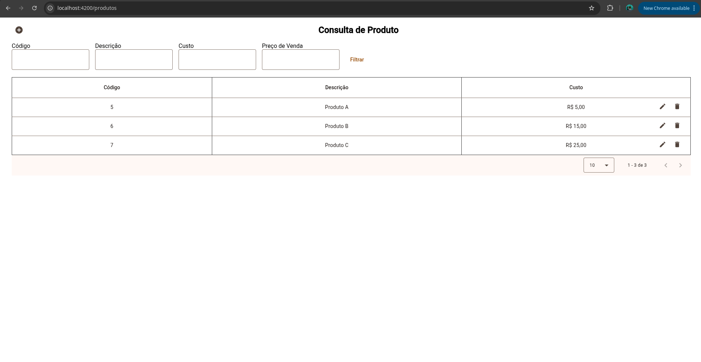
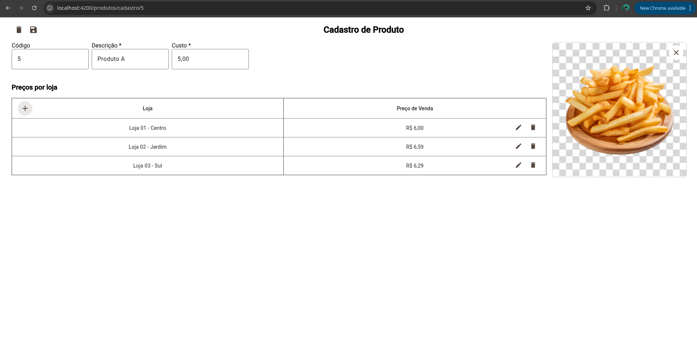
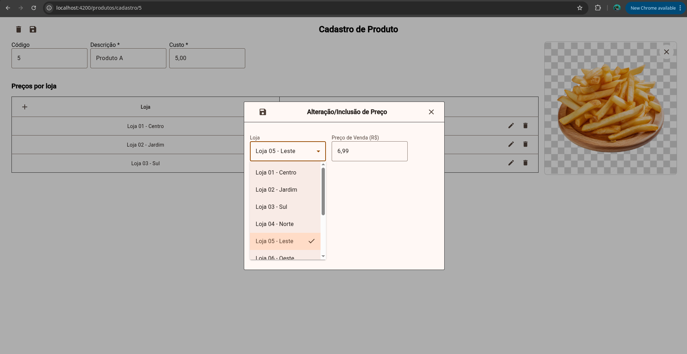
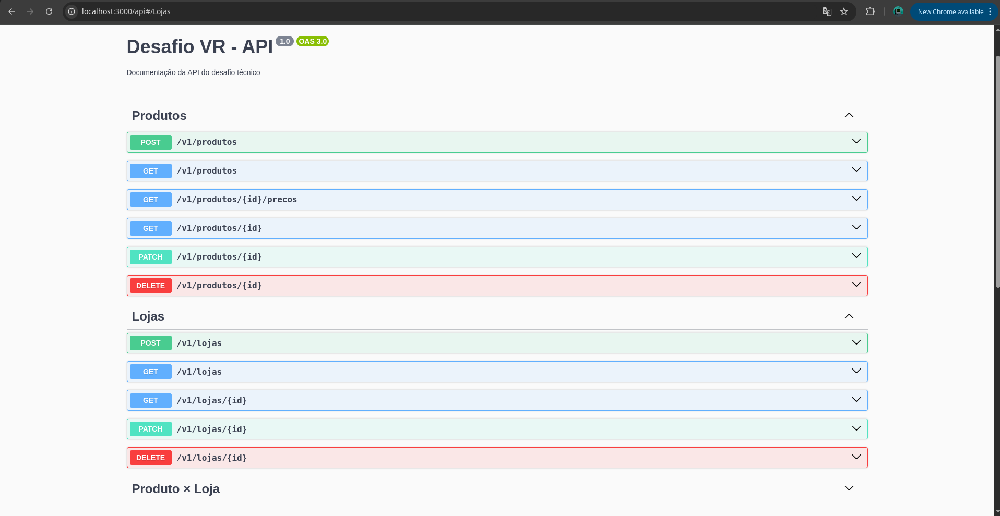

# Desafio Técnico - Desenvolvedor fullstack Angular + Node(nest)

Este projeto é uma aplicação fullstack composta por:

- [x] **Frontend** em [Angular](https://angular.io/)
- [x] **Backend** em [NestJS](https://nestjs.com/)
- [x] Banco de dados **PostgreSQL**
- [x] Testes automatizados com **Jest**, **Karma**, e **Cypress**
- [x] Orquestração completa com **Docker**

---

##  Estrutura do Projeto

```bash
desafio_tecnico/
├── desafio-vr-backend/     
├── desafio-vr-frontend/    
├── docker-compose.yml     
└── README.md
```

---

## Como Executar o Projeto

### Pré-requisitos

- Docker
- Docker Compose

### Rodar tudo com Docker

```bash
docker-compose up --build
```

- Frontend: http://localhost:4200
- Backend (Swagger): http://localhost:3000/api

---

## Funcionalidades Implementadas

### Consulta de Produto

- Filtros por:
  - Código (ID)
  - Descrição
  - Custo
  - Preço de Venda
- Ações na tabela:
  - Editar produto
  - Excluir produto

### Cadastro de Produto

- Campos:
  - Código (gerado automaticamente)
  - Descrição (obrigatório, até 60 caracteres)
  - Custo (formato 13,3)
  - Upload de imagem (.png, .jpg)
- Modal para inclusão de Preço por Loja:
  - Loja (obrigatório)
  - Preço de Venda (obrigatório, 13,3)
  - Validações:
    - Não pode haver dois preços para a mesma loja
    - Toasts com mensagens claras de erro

---

## Tecnologias

| Camada     | Tecnologias                                                   |
|------------|---------------------------------------------------------------|
| Frontend   | Angular 19, Angular Material, SCSS, Cypress             |
| Backend    | NestJS, TypeORM, PostgreSQL                             |
| Testes     | Cypress (E2E), Karma (frontend), Jest (backend)               |
| DevOps     | Docker, Docker Compose                                        |

---

## Rodando os Testes

### [x] Testes unitários - Backend
Os testes ja são iniciados ao rodar o container

```bash
docker compose exec backend npm run test
```

ou de integração:

```bash
docker compose exec backend npm run test:e2e
```

### [x] Testes unitários - Frontend
Os testes ja são iniciados ao rodar o container

```bash
docker compose exec frontend npm run test:ci
```

### [x] Testes E2E com Cypress Frontend + Backend (headless)

Os testes ja são iniciados ao rodar o container

```bash
docker compose run cypress
```
---

## Dockerfiles disponíveis

### Backend (`desafio-vr-backend/Dockerfile`)
- Roda os teste unitário com `npm run test`
- Compila e roda a API NestJS
- Roda migrations automaticamente ao iniciar

### Frontend (`desafio-vr-frontend/Dockerfile`)

- Roda os teste unitário com `ng test`
- Roda Angular com `ng serve`
- Porta 4200 exposta

### Cypress (`desafio-vr-frontend/Dockerfile.cypress`)

- Usa imagem `cypress/browsers`
- Instala dependências
- Sobe servidor Angular e roda testes E2E com Chromium

### docker-compose (`./docker-compose.yml`)

- Roda todo o projeto com testes unitários


## Requisitos Atendidos

[x] Angular com filtros reativos  
[x] Backend em NestJS com estrutura modular  
[x] CRUD completo de produtos e preços por loja  
[x] Migrations com TypeORM  
[x] Testes unitários com alta cobertura  
[x] Testes de integração E2E  
[x] Paginação e ordenação na tabela  
[x] Documentação da API com Swagger  
[x] Estrutura Dockerizada

---

## Prints da Aplicação

### Tela de Consulta de Produtos



---

### Tela de Cadastro de Produto



---

### Modal de Preço por Loja



---

### Swagger Backend


